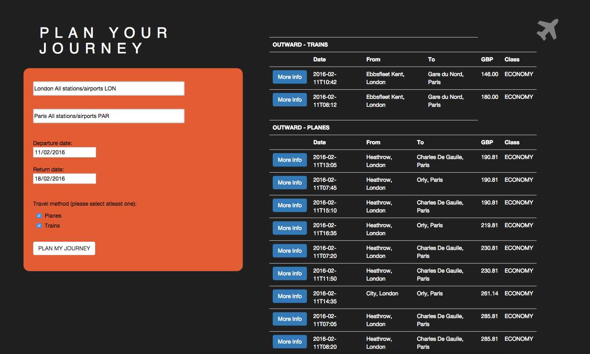

# NOT BY PLANE

An application that let you decide between different transport modes, in particular Planes and Trains.
I use the Amadeus low fare seach API to perform the research.

## Home page



## Technologies used

* MondoDB
* NodeJs
* Javascript
* AngularJs
* Amadeus low fare API
* HTML

## Objectives of exercise

We made this app to learn how to retrieve and manipulate data through a AJAX call 

## How to run the application:
```
$ git clone https://github.com/Mattia46/not-by-plane
$ http-server
```

Open your browser and type
```
http://localhost:8080/
```

